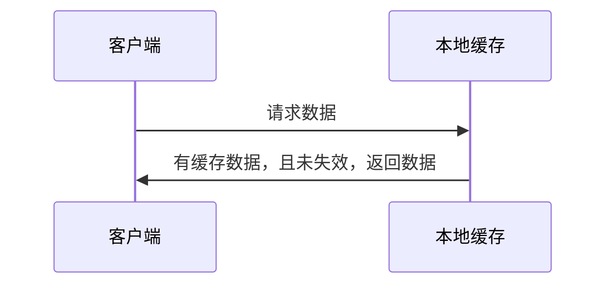
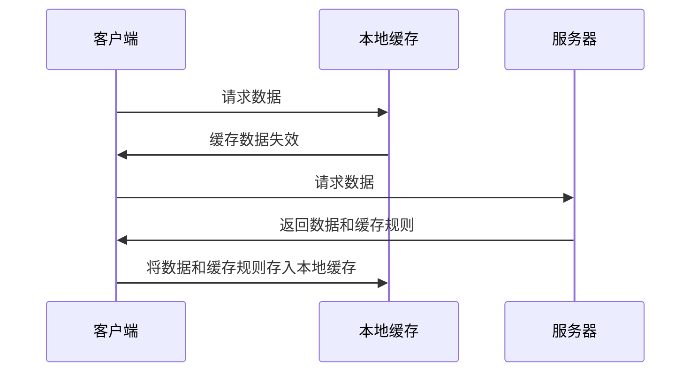
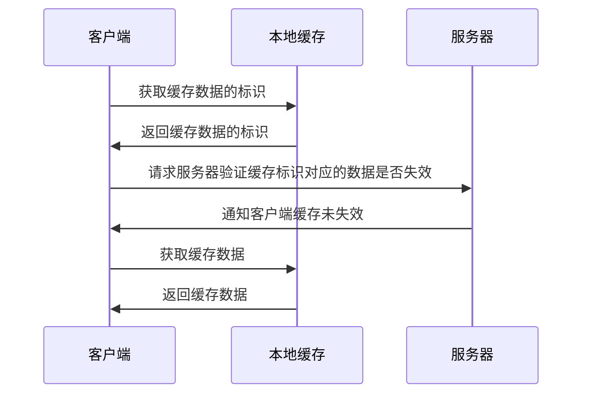
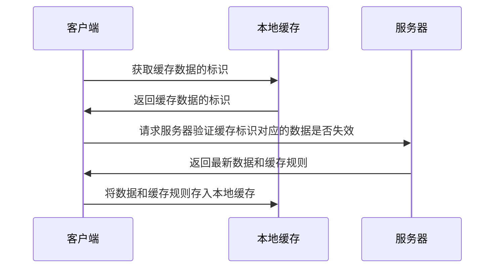

[[toc]]

缓存有客户端缓存、服务端缓存、代理服务器缓存等。HTTP中为浏览器缓存，属于客户端缓存，是web性能优化的重要手段。

# 缓存分类
浏览器缓存包含两种：强制缓存（本地缓存）和协商缓存（对比缓存）。两种缓存机制可同时存在，强制缓存优先级高于协商缓存。

## 强制缓存
又称本地缓存，若本地缓存中有所请求的数据，直接从本地缓存中获取。若本地缓存中没有请求的数据，才从服务端获取。
### 命中缓存

### 未命中缓存

## 协商缓存
又称对比缓存，客户端先从本地缓存中获取缓存数据的标识，得到标识后请求服务端验证标识是否失效。若未失效，服务端返回``304``，客户端直接从本地缓存中获取请求的数据。若标识失效，服务端会返回更新后的数据。
### 命中缓存

### 未命中缓存

# 缓存原理
与缓存相关的信息存在请求/响应的header中，

## 强制缓存
对于强制缓存，header中用

但我特么真的没钱 :cry:
大萨达撒大
大萨达撒大
爱仕达多
但我特么真的没钱 :cry:
大萨达撒大
大萨达撒大
爱仕达多
但我特么真的没钱 :cry:
大萨达撒大
大萨达撒大
爱仕达多
但我特么真的没钱 :cry:
大萨达撒大
大萨达撒大
爱仕达多
但我特么真的没钱 :cry:
大萨达撒大
大萨达撒大
爱仕达多

但我特么真的没钱 :cry:
大萨达撒大
大萨达撒大
爱仕达多
但我特么真的没钱 :cry:
大萨达撒大
大萨达撒大
爱仕达多
但我特么真的没钱 :cry:
大萨达撒大
大萨达撒大
爱仕达多
但我特么真的没钱 :cry:
大萨达撒大
大萨达撒大
爱仕达多
但我特么真的没钱 :cry:
大萨达撒大
大萨达撒大
爱仕达多

:::tip
友情提示
:::

:::danger
卧槽，粗大事了……
:::

:::warning
友情提示
:::

## 三级标题3

:::tip
友情提示
:::

:::danger
卧槽，粗大事了……
:::

### 三级标题4

:::tip
友情提示
:::

:::danger
卧槽，粗大事了……
:::

# 参考
[HTTP----HTTP缓存机制](https://juejin.im/post/5a1d4e546fb9a0450f21af23)